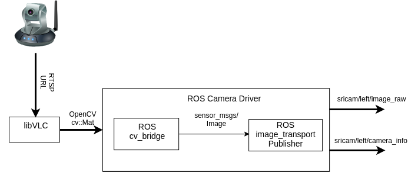

# Making a Camera Driver for the SriCam SP019 IP Camera

Following is a block diagram explaining the process for a single camera. 
The same pipeline is extended to additional cameras:




1) The camera input is obtained using libVLC library. **Explain conversion from libVLC to openCV cv::Mat - holding buffer in memory etc.** Main motivation for this was drawn from [this Stack Overflow post](http://answers.opencv.org/question/65932/how-to-stream-h264-video-with-rtsp-in-opencv-partially-answered/).
2) The next step is to convert from OpenCV `cv::Mat` to ROS image type and then publish them over the 2 required ROS 
topics (see ROS Camera Driver requirements: [this](http://wiki.ros.org/image_pipeline?distro=lunar) and [this](http://wiki.ros.org/camera_drivers) ). 
- The `cv::Mat` is converted to ROS `sensor_msgs::Image` ( see [sensor_msgs/Image datastructure](http://docs.ros.org/api/sensor_msgs/html/msg/Image.html) )  type using ROS cv_bridge. The ROS message is then published as a *raw image* using ROS `image_transport`.
- A `sensor_msgs::CameraInfo` object is also created and published. It contains the monocular monocular/stereo camera calibration parameters for each camera. For more information see comments in [ROS CameraIno](http://docs.ros.org/api/sensor_msgs/html/msg/CameraInfo.html)


The header frame_id and time stamp member fields for all published messages are explained as comments in the code. 

### Managing Calibration Information

Calibration information obtained from the stereo calibration using the [ROS camera_calibration](http://wiki.ros.org/camera_calibration) package is handled using the [ROS camera_info_manager](http://wiki.ros.org/camera_info_manager). 

- A camera_info_manager (automatically) advertises the required service set_camera_info required by the ROS calibration tools. 

- There are two camera_info_managers, each handling one camera in the stereo camera pair.

### Installation on an Ubuntu Xenial

Install the SDK for VLC library ( more information at [VLC official installation guide](https://wiki.videolan.org/LibVLC_Tutorial/) ).

```sh
$ apt-cache search libvlc # Optional comamnd to find dev package, if library below isn't found.
$ sudo apt-get install libvlc-dev
```

**For ROS packages**: See official instructions ([ROS image_pipeline](http://wiki.ros.org/image_pipeline?distro=lunar)) if ROS image_pipeline package does not exist in current ROS installation


### Finding IP address of wireless IP camera (On a Linux machine)

##### If connecteing to single IP camera via ethernet cable:
```sh
$ run ifconfig  #To check ethernet Broadcast (BCast) address.
$ ping -b <broadcast_address>  # (BCast) address obtained from command above.
$ arp -a
```
ping some of the IP addresses obtained as results of arp. 
Verify quickly by opening as RTSP URL in VLC media player (Media --> Open Network Stream --> enter RTSP URL under "Network" tab)
